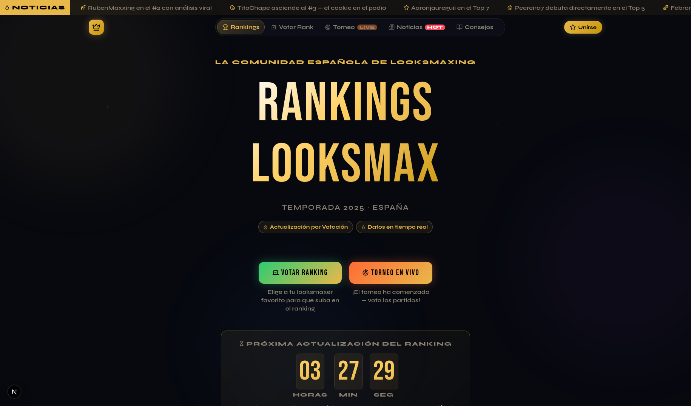

# LooksMax España (Mogverso)

Ranking oficial de looksmaxing en España, migrado a **Next.js** para despliegue en **Vercel**.



## Stack

- [Next.js](https://nextjs.org/) 16 (App Router)
- [TypeScript](https://www.typescriptlang.org/)
- [Tailwind CSS](https://tailwindcss.com/) 4
- [Firebase Realtime Database](https://firebase.google.com/) (votaciones en tiempo real)
- ESLint + Prettier + markdownlint

## Inicio rápido

```bash
npm install
cp .env.example .env.local
# Edita .env.local con tus credenciales de Firebase
npm run dev
```

Abre [http://localhost:3000](http://localhost:3000).

## Variables de entorno

Copia `.env.example` a `.env.local`:

| Variable                         | Descripción                        |
| -------------------------------- | ---------------------------------- |
| `NEXT_PUBLIC_FIREBASE_*`         | Credenciales del proyecto Firebase |
| `NEXT_PUBLIC_ADSENSE_CLIENT`     | ID de cliente AdSense (opcional)   |
| `NEXT_PUBLIC_RECAPTCHA_SITE_KEY` | Clave reCAPTCHA v3 (opcional)      |
| `NEXT_PUBLIC_SITE_URL`           | URL pública (metadatos SEO)        |

## Imágenes

Las fotos de creadores viven en `src/assets/creators/` como WebP importados en código (`creatorImage()` en `index.ts`). Ver `src/assets/creators/README.md`.

## Scripts

| Comando                | Descripción                    |
| ---------------------- | ------------------------------ |
| `npm run dev`          | Servidor de desarrollo         |
| `npm run build`        | Build de producción            |
| `npm run start`        | Servidor de producción         |
| `npm run lint`         | ESLint                         |
| `npm run typecheck`    | TypeScript (`tsc --noEmit`)    |
| `npm run format`       | Prettier (formatear)           |
| `npm run format:check` | Comprueba formato Prettier     |
| `npm run mdlint`       | markdownlint en archivos `.md` |

## Despliegue en Vercel

1. Importa el repositorio en [vercel.com](https://vercel.com).
2. Añade las variables de `NEXT_PUBLIC_*` en **Settings → Environment Variables**.
3. Despliega; el framework se detecta como Next.js automáticamente.

## Estructura del proyecto

```text
src/
  app/           # Layout, estilos globales, página principal
  components/    # LooksMaxApp y UI React (looksmax/)
  contexts/      # FirebaseProvider
  data/          # Rankers, léxico, torneo, avatares
  hooks/         # Ranking, votaciones, torneo
  lib/firebase/  # Cliente Firebase
  lib/looksmax/  # Lógica pura (ranking, tipos)
firebase/        # Reglas RTDB de ejemplo (ver README)
public/          # Assets estáticos (SVG, etc.)
src/assets/      # Imágenes importadas (creadores WebP)
docs/            # Documentación
```

## Documentación

- [Arquitectura](./docs/arquitectura.md)
- [Desarrollo](./docs/desarrollo.md)
- [Despliegue](./docs/despliegue.md)
- [Firebase (reglas RTDB)](./firebase/README.md)
