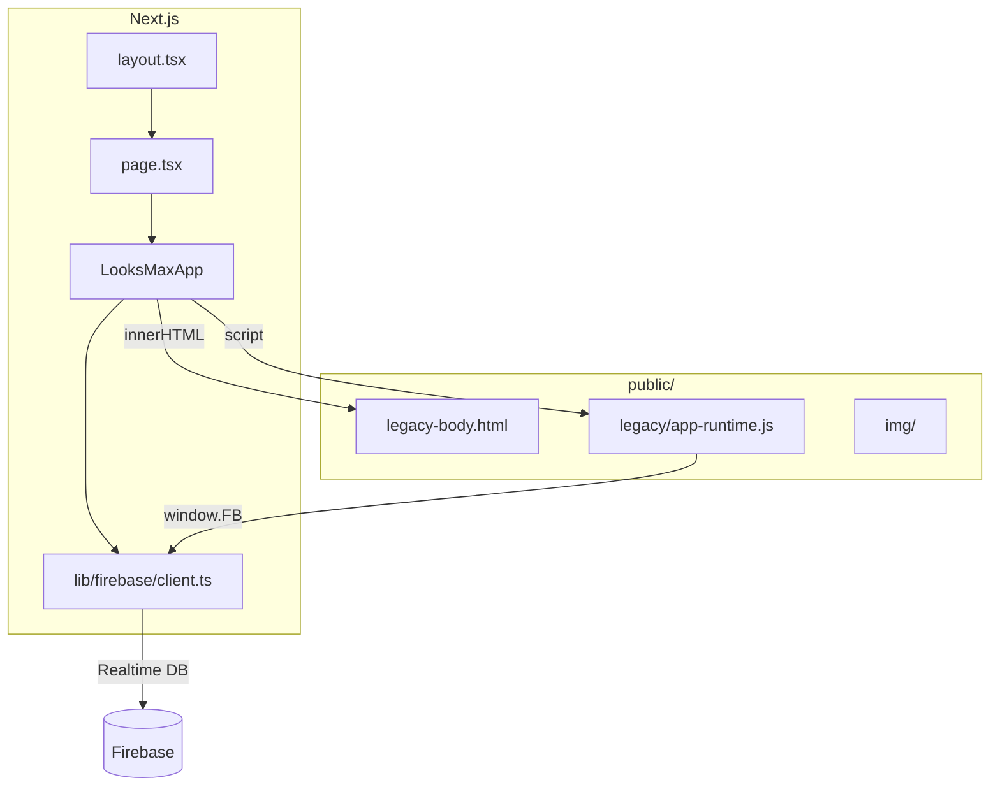

# Arquitectura

## Visión general

La aplicación combina **Next.js** (shell, configuración, Firebase tipado) con el **marcado y la lógica** de la web original, preservando el comportamiento de votaciones, torneo y ranking en tiempo real.

## Capas

### 1. Shell Next.js (`src/`)

- **`layout.tsx`**: fuentes (Bebas Neue, Syne), metadatos en español, `lang="es"`.
- **`LooksMaxApp`**: componente cliente que carga el HTML legacy, ejecuta el runtime y conecta Firebase.
- **`lib/firebase/client.ts`**: inicialización de Firebase, votaciones atómicas, anuncios globales y API expuesta en `window.FB`.

### 2. Capa legacy (`public/`)

- **`legacy-body.html`**: estructura DOM (páginas, modales, ticker, navegación).
- **`app-runtime.js`**: navegación, renderizado del ranking, torneo, perfiles, léxico, timers y listeners.

Esta capa se mantiene para no romper la lógica compleja (~100 KB) mientras se migra gradualmente a componentes React.

### 3. Datos

- **`src/data/rankers.ts`**: lista tipada de participantes (fuente para `window.RANKERS`).
- **Firebase**: overrides de posición, movimientos, votaciones activas, estado del torneo.

## Flujo de arranque

1. El usuario abre `/`.
2. `LooksMaxApp` asigna `window.RANKERS` desde TypeScript.
3. Se inyecta `legacy-body.html` en el DOM.
4. Se carga `app-runtime.js` (define funciones globales y UI estática).
5. `initFirebaseClient()` configura `window.FB` y dispara `firebase-ready`.
6. El runtime escucha el evento y llama a `loadAllData()` para sincronizar con Firebase.

## Próximos pasos (refactor opcional)

- Extraer páginas a componentes React (`RankingsPage`, `TorneoPage`, …).
- Mover `app-runtime.js` a módulos TypeScript bajo `src/lib/`.
- Sustituir `innerHTML` por JSX para mejor accesibilidad y pruebas.
